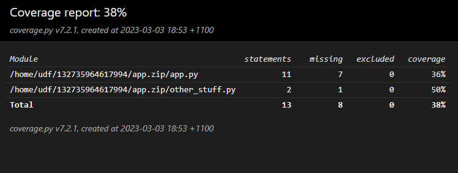
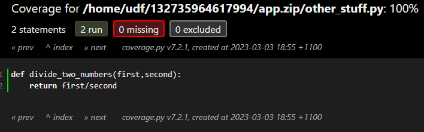

# Snowflake Developer CLI

This is an open source and community supported tool. Support is provided on a best effort basis by project contributors.

## Overview

SnowCLI is a command line interface for working with Snowflake. It lets you create, manage, update, and view apps running in Snowflake.

This is an open source project and contributions are welcome (though the project is maintained on a best-effort basis).

We plan to incorporate some patterns and features of this CLI into the Snowflake CLI (SnowSQL) in the future. We hope this project starts a conversation about what a delightful developer experience could look like, and we'd love your help in shaping that with us!

### Tour and quickstart

[](https://youtu.be/WDuBeAgbTt4)

## Benefits of SnowCLI

SnowCLI lets you locally run and debug Snowflake apps, and has the following benefits:

- Search, create, and upload python packages that may not be yet supported in Anaconda.
- Has support for Snowpark Python **user defined functions** and **stored procedures**, **warehouses**, and **Streamlit** apps.
- Define packages using `requirements.txt`, with dependencies automatically added via integration with Anaconda at deploy time.
- Use packages in `requirements.txt` that aren't yet in Anaconda and have them manually included in the application package deployed to Snowflake (only works with packages that don't rely on native libraries).
- Update existing applications with code and dependencies automatically altered as needed.
- Deployment artifacts are automatically managed and uploaded to Snowflake stages.

## Limitations of SnowCLI

SnowCLI has the following limitations:

- You must have the [SnowSQL](https://docs.snowflake.com/en/user-guide/snowsql.html) configuration file to authenticate to SnowCLI. See the [Prerequisites](#prerequisites) for more details.
- To run Streamlit in Snowflake using SnowCLI, your Snowflake account must have access to the Streamlit private preview.

## Install SnowCLI

### Install with Homebrew (Mac only)

Requires [Homebrew](https://brew.sh/).

```bash
brew tap sfc-gh-jhollan/snowcli
brew install snowcli
snow --help
```

### Install with pip (PyPi)

Requires Python >= 3.8

```bash
pip install snowflake-cli-labs
snow --help
```

### Install from source

Requires Python >= 3.10 and git

```bash
git clone https://github.com/snowflake-labs/snowcli
cd snowcli
# you can also do the below in an active virtual environment:
# python -m venv .venv
# source .venv/bin/activate
pip install -r requirements.txt
hatch build && pip install .
snow --version
```

You should now be able to run `snow` and get the CLI message.

## Get started using SnowCLI

Use SnowCLI to build a function or stored procedure, or create a streamlit if you have access to the Streamlit in Snowflake private preview.

### Prerequisites

You must add your credentials to connect to Snowflake before you can use SnowCLI.

#### Add credentials with SnowCLI

SnowCLI uses the same configuration file as SnowSQL. If you don't have SnowSQL installed, [download SnowSQL](https://developers.snowflake.com/snowsql/) and install it. See [Installing SnowSQL](https://docs.snowflake.com/en/user-guide/snowsql-install-config.html). You do not need to set up SnowSQL to use SnowCLI.

After installing SnowSQL, use the following SnowCLI command to add your Snowflake account credentials:

`snow connection add`

Provide a name for your connection, your account, username, and password for Snowflake.

#### Add credentials manually on *nix systems

If you do not want to install SnowSQL, you can add Snowflake account credentials manually:

1. In your home directory, make `.snowsql` directory with a `config` file:

   `mkdir .snowsql`
   `cd .snowsql`
   `touch config`

2. Open the config file for editing:

   `vi config`

3. Add a new configuration for your Snowflake connection with SnowCLI. You must prefix the configuration with `connections.`.

For example, to add a Snowflake account `myaccount` for a user profile `johndoe` and a password of `hunter2`, add the following:

```ini
[connections.connection_name]
accountname = myaccount
username = jondoe
password = hunter2
```

#### Add credentials manually using Windows

1. Create a `.snowsql` folder with a `config` file at the following path: `%USERPROFILE%\.snowsql\config`
2. Add a new configuration for your Snowflake connection with SnowCLI. You must prefix the configuration with `connections.`.

### Manage packages in Snowflake Stages

You can use the Snowflake CLI to assist you in creating and uploading custom packages for Snowflake. This includes both full Python packages (and all needed dependencies) and Python packages that have native dependencies that are supported by Anaconda. All dependency evaluation is performed using `pip` on the machine the SnowCLI runs on and can create and help upload packages. Here's a flow to upload a custom package:

1. Check to see if a package is supported: `snow package lookup <package-name>`
   - NOTE: if you see a WARNING! message, it means the package has likely has native libraries that are NOT supported by the Anaconda Snowflake channel.
2. Create a zip file of the package: `snow package create <package-name>` - this creates a `{package}.zip` file in the current directory that can be uploaded to a stage to used in imports to include the package.
3. Connect to snowflake
   - `snow login`
   - `snow configure`
4. Upload to a stage (I'll upload to a stage called `packages` in the database / schema configured in previous step): `snow package upload -f <package-name>.zip -s packages --overwrite`
5. You can now use the package in functions / procedures by adding an import to `@packages/<package-name>.zip`.

It's worth noting that if you create and publish functions and procedures using the SnowCLI using the patterns below (`snow function` and `snow procedure`), SnowCLI will automatically bundle packages + code in a single zip that is created. But you can manage packages independently in stages as desired.

### Build a function

To build a function or a stored procedure using SnowCLI, do the following:

1. Navigate to an empty directory to create your function.
2. Run the command:

   `snow function init`

    SnowCLI populates the directory with the files for a basic function. You can open `app.py` to see the files.
3. Test the code by running the `app.py` script:

   `python app.py`

    You see the message: `Hello World!`
4. Package the function:

   `snow function package`

    This creates an `app.zip` file that has your files in it
5. Log in to snowflake:

   `snow login`
6. Configure your first environment:

   `snow configure`
7. Create a function:

   `snow function create`
8. Try running the function:

   `snow function execute -f 'helloFunction()'`

    You see Snowflake return the message: 'Hello World!'

After building your function, you can modify `app.py`, `requirements.txt`, or other files and follow a similar flow, or update a function by running the following:

`snow function update -n <myfunction> -f <app.zip>`

### Create a Streamlit

To create a Streamlit, do the following:

Note: Your account must have access to the Streamlit in Snowflake private preview to create a Streamlit.

1. Change to a directory with an existing Streamlit app, or create a directory for a new Streamlit app.
2. Log into Snowflake::

    `snow login`
3. Create an environment and select your database, schema, role, and warehouse:

   `snow configure`

   The environment name defaults to 'dev'.
4. Create a streamlit with a name that you specify:

    `snow streamlit create <name>`

    If you don't specify a name, the file defaults to `streamlit_app.py`.
5. Deploy your app and open it in the browser:

    `snow streamlit deploy <name> -o`

#### Deploy a packaged Streamlit app (temporary workaround)

As at April 2023, you must provide a single file script to Streamlit, with an optional environment.yml file containing a list of Anaconda packages.

By adding the `--use-packaging-workaround` parameter during `snow streamlit create` and `snow streamlit deploy`, you can have your directory packaged into an app.zip file with PyPi packages.

A wrapper file will be generated as a Streamlit entrypoint, and it will download the app.zip from the stage, add it to the system path and import the original Streamlit script.

### Create a stored procedure

See [Build a function](#build-a-function).

### Code coverage for stored procedures

When running `snow procedure create` or `snow procedure update`, you can choose to add the flag `--install-coverage-wrapper`. This will automatically capture code coverage information whenever your stored procedure is invoked.

For example, imagine an `app.py` like this:

```
import sys

def calculator(session,thing_to_do:str,first:float,second:float):
  if thing_to_do=='add':
    return first + second
  if thing_to_do=='subtract':
    return first - second
  if thing_to_do=='multiply':
    return first * second
  if thing_to_do=='divide':
    return other_stuff.divide_two_numbers(first,second)
  raise Exception(f"Unknown thing_to_do {thing_to_do}")
```

and `other_stuff.py` like this:

```
def divide_two_numbers(first,second):
    return first/second
```

After `snow procedure package`, we run:

`snow procedure create -n calculator -h "app.calculator" -i "(thing_to_do string, first float, second float)" --return-type "numeric" --install-coverage-wrapper --replace-always`

Then invoke it:

`snow procedure execute -p "calculator('add',1,1)"`

We can build a coverage report:

`snow procedure coverage report -n "calculator" -i "(thing_to_do string, first float, second float)"`

Under htmlcov/index.html we see a summary of the two files:



and drilling into app.py:


Then use a couple of other code paths:

`snow procedure execute -p "calculator('multiply',3,4)"`

`snow procedure execute -p "calculator('divide',10,2)"`

If we run the report again, we're now up to 85%:


With app.py showing a bit more green:


and other_stuff.py fully covered:




#### More code coverage tips:
- Remember to `clear` the coverage data whenever you change the code or start a new test run.
- Ensure that you don't enable code coverage in production, it adds a delay and a small amount of stage storage for each invocation.
- You can choose the output format by using the `--output-format` option
- You can write the coverage percentage value back into Snowflake as a procedure comment, by using the `--store-as-comment` option. This means that after your test suite completes, you can check coverage across a number of procedures with a query like so:

```
select COALESCE(COMMENT,0)::numeric(5,2) as COVERAGE, *
from information_schema.procedures
where COVERAGE < 75;
```


## Contributing
If interested in contributing, you will want to instanstiate the pre-commit logic to help with formatting and linting of commits. To do this, run the following in the `snowcli` cloned folder on your development machine:

```bash
pip install pre-commit
pre-commit
```

## Get involved

Have a feature idea? Running into a bug? Want to contribute? We'd love to hear from you! Please open or review issues, open pull requests, or reach out to us on Twitter or LinkedIn [@jeffhollan](https://twitter.com/jeffhollan) and [@jroes](https://twitter.com/jroes).
